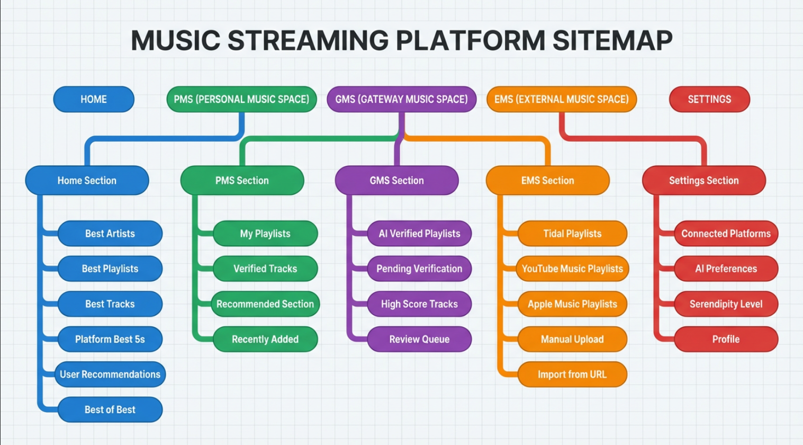

# 개요
1. 자기만의 음악공간이(PMS) 있고 이곳에는 이미 검증된 트랙과 플레이리스트가 있습니다.
2. 외부에서 불러온 음악공간이(EMS) 있고 이곳에는 검증되지 않은 트랙과 플레이리스트가 있습니다.
3. PMS에 추가될 트랙이나 플레이리스트가 존재하는 공간(
    GMS)이 있습니다. 이곳은 EMS에 있는 플레이리스트를 검증하는 공간으로 사용되고 EMS에 있는 곡들을 PMS에 추가할 때 사용됩니다. GMS는 나의 취향이 학습된 AI가 EMS의 플레이리스트를 AI가 검증하여 통과된 트랙과 플레이리스트가 존재하는 공간으로 사용됩니다.
4. GMS에 있는 플레이리스트나 트랙을 사용자가 검증하여 PMS에 추가합니다.
5. GMS의 UX는 사용자가 음악 감상 및 검증하기에 최적화된 UI를 제공합니다.
6. PMS는 사용자가 음악을 즐기기 위한 공간으로 사용됩니다.
7. PMS의 UX는 사용자가 음악을 즐기기 위한 최적화된 UI를 제공합니다.
8. PMS는 사용자가 주로 사용하는 음악공간으로 사용되며 GMS중 점수가 높은 트랙이나 플레이리스트가 추천섹션이됩니다.
9. EMS는 사용자가 직접 플레이리스트 파일을 불러와서 넣을 수 있으며 자동으로 특정 스트리밍 플랫폼의 플레이리스트를 불러와서 넣을 수 있습니다.
10. 의외성을 주입하여 사용자의 취향에 너무 매몰되어 거기에 갇히게 되는 것을 방지합니다.
11. 사용자 자신이 구독한 스트리밍 플랫폼의 스트리밍 API를 사용하여 음악 감상을 하게 됩니다.

# 외부 음악 스트리밍 플랫폼
1. Tidal
2. YouTube Music
3. Apple Music

# 플레이리스트 관련 최초 생성 동작
1. 사용자 회원가입 및 로그인 -> <strong>회원정보 테이블</strong>
2. 특정 스트리밍 플랫폼에 로그인(복수개일 수 있음)후 플레이리스트 가져옴 -> <strong>플레이리스트 테이블</strong>에 저장 <= 플랙 필드는 개인 임시 플레이리스트의 약자인 PTP(Personal Temporary Playlist) 
3. 플레이리스트를 모두 가져와 저장이 되면 플랙 필드는 개인 정규 플레이리스트의 약자인 PRP(Personal Regular Playlist)로 변경 <= space_type : PMS(Personal Music Space) * 정규 플레이리스트 테이블을 분리할 것인지 결정이 필요함
4. 이후 플레이리스트에 등록된 트랙정보를 이용 개인 모델 학습이 진행됨

# 사용자가 주소나 csv, json을 이용 플레이리스트를 등록 하는 경우 
1. 한두곡 정도는 사용자가 좋아하는 곡 또는 아는곡일 수 있겠으나 대부분은 모르는 곡일 가능이 높으므로 EMS에 저장 
=> 플레이리스트 테이블에 저장 <= 플랙필드 PTP space_type : PMS
2. 플레이리스트 여러개를 등록할 수도 있음
3. 등록이 끝나면 분석 버튼(버튼 라벨은 추후 논의)을 통하여 필터링 => 필터링이 끝나면 통과된 곡들의 플레이 리스트가 생성되고 플랙필드는 PTP에서 PFP로 변경됨 space_type : PMS 로 변경
4. 필터링에 통과된 곡 목록이 뜨고(편집할 수 있음 - 삭제) 플레이리스트 제목을 입력후 저장 <= space_type : PMS

# 사이트 추천 플레이리스트나 트랙을 사용자가 검증하여 PMS에 추가하는 경우
## 제공된 플레이리스트 전체를 분석하여 등록하려 하는 경우
1. 사용자가 제공된 트랙 리스트를 편집(삭제) 후 제공된 제목을 그대로 쓰거나 수정하여 등록 

## 트랙 하나만 분석하여 등록하는 기능은 없음(듣고 판단하면 됨)

## 여러 트랙을 묶어(몇개 이상인지 논의 필요) 플레이리스트화 시킨 다음 분석 등록하려하는 경우
1. 분석 -> 필터링 -> 플레이리스트 제목을 입력후 등록

### 각 플랫폼 키값
1. TIDAL: 
Client ID
P4pl9RgKUCLQO2a5

Client secret
HcVwt0GwD6MOcRZDBHrPdlj22MVFGCvx4S1STWtSJYE=

2. YOUTUBE MUSIC: 
Client ID

Client secret

3. APPLE MUSIC: 
Client ID

Client secret

### MAIN구성
- 베스트 아티스트, 플레이리스트, 트랙
- 각 플랫폼별 베스트 5 트랙, 앨범, 아티스트
- 이용자의 추천 플레이리스트 3선
- BEST OF BEST 플레이리스트, 앨범, 트랙

### EMS구성
- 각 스트리밍플랫폼에서 자동으로 플레이리스트를 가져와서 DB에 저장후 EMS에 표시
    -- TIDAL: K-POP 관련 플레이리스트 가져올 수 있음, 그외 다양한 플레이리스트 가져올 수 있음 -> 자동 출력
    -- YOUTUBE MUSIC: 메인에 떠있는 각 플레이리스트 카테고리중 하나씩 몇개 가져와 출력함
    -- APPLE MUSIC: 메인에 떠있는 플레이리스트 랜덤하게 몇개 가져와 출력함

🗺️ 사이트맵 메뉴 트리 구성도
사이트맵 구조도

📋 상세 메뉴 구조 설명
🏠 1. HOME (메인 홈)
사용자가 가장 먼저 만나는 대시보드 화면

1.1 베스트 아티스트 🎤
사용자가 가장 많이 듣는 아티스트 Top 10
최근 30일 기준 재생 횟수
1.2 베스트 플레이리스트 📁
재생 횟수 기준 인기 플레이리스트
PMS에서 자동 선별
1.3 베스트 트랙 🎵
가장 많이 재생된 개별 트랙
좋아요/재생 수 혼합 점수
1.4 플랫폼별 베스트 5 🏆
Tidal Top 5: 트랙, 앨범, 아티스트
YouTube Music Top 5: 트랙, 앨범, 아티스트
Apple Music Top 5: 트랙, 앨범, 아티스트
1.5 추천 플레이리스트 3선 ⭐
AI가 선택한 GMS 고득점 플레이리스트
사용자 취향 + 의외성 알고리즘 적용
1.6 BEST OF BEST 👑
전체 플랫폼 통합 베스트
플레이리스트, 앨범, 트랙 각 1위
💚 2. PMS (Personal Music Space) - 나만의 음악 공간
검증 완료된 개인 음악 라이브러리

2.1 내 플레이리스트 📚
전체 보기: 모든 정규 플레이리스트(PRP)
최근 추가: 시간순 정렬
자주 듣는: 재생 횟수 기준
장르별: 자동 분류
무드별: AI 자동 태깅
2.2 검증된 트랙 ✅
PMS에 속한 모든 개별 트랙
필터: 아티스트, 앨범, 장르
정렬: 추가일, 재생 횟수, 좋아요
2.3 추천 섹션 🎁
오늘의 추천: 일일 갱신
이 곡과 비슷한: 관련 트랙
다시 들어보기: 오래된 플레이리스트
2.4 최근 추가 🆕
최근 7일 내 추가된 트랙/플레이리스트
타임라인 형식
2.5 통계 📊
청취 패턴 분석
장르 분포도
월간 리포트
🧡 3. GMS (Gateway Music Space) - 검증 대기 공간
AI 1차 필터링 통과, 사용자 최종 검증 대기

3.1 AI 검증 플레이리스트 🤖
AI 점수 70점 이상 플레이리스트
매칭도 시각화 표시
액션:
전체 승인
개별 편집 후 승인
거부
3.2 검증 대기 중 ⏳
아직 사용자가 확인하지 않은 항목
우선순위 정렬 (AI 점수 기준)
3.3 고득점 트랙 🌟
85점 이상 개별 트랙
빠른 추가 기능
3.4 검토 큐 📋
보류 상태의 트랙/플레이리스트
나중에 다시 듣기
3.5 미리듣기 모드 🎧
30초 자동 재생
스와이프로 Keep/Remove
Tinder 스타일 UI
💜 4. EMS (External Music Space) - 외부 음악 공간
검증되지 않은 외부 소스 음악

4.1 Tidal 플레이리스트 🔵
자동 수집:
K-POP 플레이리스트
트렌딩 플레이리스트
장르별 큐레이션
수동 불러오기: URL 입력
4.2 YouTube Music 플레이리스트 🔴
자동 수집:
메인 피처드 플레이리스트
카테고리별 인기 목록
수동 불러오기: URL 입력
4.3 Apple Music 플레이리스트 ⚪
자동 수집:
에디터 추천
신규 플레이리스트
수동 불러오기: URL 입력
4.4 수동 업로드 📤
파일 업로드: CSV, JSON
URL 입력: 직접 링크 추가
일괄 처리: 여러 플레이리스트 동시
4.5 가져오기 센터 🔄
진행 중인 임포트 작업
임포트 히스토리
실패한 작업 재시도
4.6 분석 대기 📊
아직 분석되지 않은 플레이리스트
일괄 분석 버튼
선택 분석 가능
⚙️ 5. SETTINGS (설정)
시스템 및 계정 관리

5.1 연결된 플랫폼 🔗
Tidal 연동 관리
YouTube Music 연동 관리
Apple Music 연동 관리
액션: 연결, 연결 해제, 재인증
5.2 AI 환경설정 🧠
학습 데이터 관리:
학습 데이터 초기화
특정 기간 데이터 제외
필터링 민감도: 엄격 ↔ 관대
추천 알고리즘: 가중치 조정
5.3 의외성 레벨 🎲
슬라이더: 1 (안전) ~ 10 (모험적)
레벨별 설명 제공
실시간 적용
5.4 프로필 👤
사용자 정보 수정
비밀번호 변경
선호 장르 설정
5.5 재생 설정 🎛️
음질 설정
크로스페이드 지속시간
노멀라이제이션
5.6 알림 설정 🔔
새 추천 알림
플랫폼 업데이트 알림
이메일 알림
5.7 데이터 및 개인정보 🔒
데이터 다운로드
계정 삭제
개인정보 처리방침
🎯 주요 사용자 플로우
플로우 1: 첫 방문 사용자
로그인 → 플랫폼 연결 → 자동 플레이리스트 수집 (EMS) 
→ AI 학습 시작 → HOME 대시보드
플로우 2: 외부 플레이리스트 추가
EMS → URL 입력/파일 업로드 → "분석하기" 클릭 
→ GMS로 이동 → 검토 및 편집 → PMS에 추가
플로우 3: 일상적 음악 감상
HOME → 추천 플레이리스트 3선 → 재생 
또는 PMS → 내 플레이리스트 → 선택 재생
플로우 4: 새로운 음악 발견
GMS → AI 검증 플레이리스트 → 미리듣기 모드 
→ 마음에 드는 곡 선택 → PMS에 추가
📱 네비게이션 구조
메인 네비게이션 (Top Level)
┌─────────────────────────────────────────────────┐
│  🏠 HOME  |  💚 PMS  |  🧡 GMS  |  💜 EMS  |  ⚙️  │
└─────────────────────────────────────────────────┘
사이드바 (Secondary Navigation)
각 섹션별 하위 메뉴 표시
접기/펼치기 가능
활성 메뉴 하이라이트
플로팅 버튼 (Quick Actions)
🔍 검색: 전역 검색
➕ 빠른 추가: URL/파일 업로드
🎵 현재 재생 중: 미니 플레이어
🎨 색상 코드 (Color Coding)
공간	색상	의미
HOME	🔵 Blue (#4A90E2)	중립적, 신뢰
PMS	💚 Green (#7ED321)	안전, 검증됨
GMS	🧡 Orange (#F5A623)	주의, 검토 필요
EMS	💜 Purple (#BD10E0)	탐색, 새로움
Settings	⚫ Gray (#4A4A4A)	기능적
💡 UX 최적화 포인트
GMS 특화 기능
배치 작업: 여러 플레이리스트 한 번에 검증
스마트 필터: AI 점수 범위로 필터링
비교 모드: 원본 플레이리스트와 필터링 결과 비교
PMS 특화 기능
스마트 셔플: 비슷한 곡끼리 그룹화
무드 기반 재생: 현재 기분에 맞는 곡 자동 선택
플레이리스트 병합: 여러 플레이리스트 합치기
EMS 특화 기능
자동 업데이트: 매일 새벽 자동 수집
중복 제거: 이미 PMS에 있는 곡 필터링
일괄 분석: 모든 플레이리스트 한 번에 AI 필터링